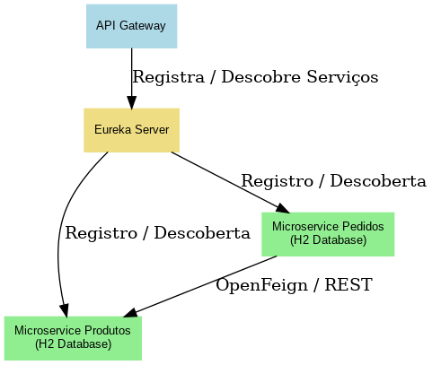

# microservice-pedidos DIO.me / NTT DATA

Microserviço de gerenciamento de pedidos, parte do projeto **nttdata-store**.

Este serviço é responsável por registrar pedidos e consultar detalhes dos produtos associados, consumindo os dados do microservice de produtos via **Eureka Service Discovery** e **OpenFeign**.

---

## 🚀 Funcionalidades principais

- Cadastro de pedidos com cliente, produto e quantidade.
- Listagem de pedidos simples.
- Listagem detalhada com dados completos do produto (via comunicação com microservice-produtos).
- Integração com Eureka Server para registro e descoberta de serviços.
- Comunicação desacoplada entre microservices com OpenFeign.
- Banco em memória H2 para desenvolvimento rápido e fácil.

---

## 🗂 Arquitetura do Projeto



---

## 📂 Estrutura de Diretórios

```
nttdata-store/
├── api-gateway/
│ ├── src/
│ │ ├── main/java/com/nttdata/apigateway/
│ │ └── resources/application.properties
│ └── pom.xml
├── docs/
│ └── arquitetura_nttdata_store.png
├── eureka-server/
│ ├── src/
│ │ ├── main/java/com/nttdata/eurekaserver/
│ │ └── resources/application.properties
│ └── pom.xml
├── microservice-pedidos/
│ ├── src/
│ │ ├── main/java/com/nttdata/microservicepedidos/
│ │ │ ├── controller/
│ │ │ ├── model/
│ │ │ ├── repository/
│ │ │ └── client/
│ │ └── resources/application.properties
│ └── pom.xml
├── microservice-produtos/
│ ├── src/
│ │ ├── main/java/com/nttdata/microserviceprodutos/
│ │ │ ├── controller/
│ │ │ ├── model/
│ │ │ └── repository/
│ │ └── resources/
│ │ ├── application.properties
│ │ └── data.sql
│ └── pom.xml
├── postman/
│ └── nttdata-store.postman_collection.json
├── .gitignore
├── LICENSE
└── README.md
```


---

## 🔧 Pré-requisitos

- Java 17
- Maven 3.8+
- [Eureka Server](https://github.com/niqueborges/eureka-server) rodando em `http://localhost:8761`
- microservice-produtos rodando em `http://localhost:8100`

---

## 🛠️ Como rodar

1. Clone o repositório:

```bash
git clone https://github.com/niqueborges/microservice-pedidos.git
cd microservice-pedidos

2.  Configure o `application.properties` se necessário (padrão já pronto para ambiente local).

3.  Inicie a aplicação:
   mvn spring-boot:run


4.  Acesse o Eureka Server (`http://localhost:8761/`) e confirme que o serviço `microservice-pedidos` está registrado.

-----

## 📦 Endpoints disponíveis

### Microservice-Produtos
| Método | URL                                    | Descrição                                    |
|--------|----------------------------------------|----------------------------------------------|
| GET    | `http://localhost:8100/produtos`       | Lista todos os produtos                      |
| POST   | `http://localhost:8100/produtos`       | Cria um novo produto                         |

### Microservice-Pedidos
| Método | URL                                    | Descrição                                    |
|--------|----------------------------------------|----------------------------------------------|
| POST   | `/pedidos`                             | Cria um novo pedido                          |
| GET    | `/pedidos`                             | Lista todos os pedidos                       |
| GET    | `/pedidos/detalhes`                    | Lista pedidos com detalhes dos produtos      |
| POST   | `/pedidos/detalhes`                    | Lista pedidos com detalhes, com filtros via body |
| GET    | `/pedidos/{id}`                        | Busca um pedido pelo ID                      |

---

## 🧪 Collection do Postman

Para facilitar os testes, este repositório contém uma collection do Postman com todos os endpoints configurados.

📂 Caminho do arquivo:

postman/nttdata-store.postman_collection.json

📥 Importar manualmente no Postman:

Abra o Postman.

Clique em Import.

Selecione o arquivo nttdata-store.postman_collection.json na pasta postman/ do projeto.

Todos os endpoints estarão prontos para serem testados.

---
  

## 🔗 Integração com microservice-produtos

O serviço consome o endpoint `/produtos` do microservice-produtos via OpenFeign para trazer informações atualizadas do produto relacionado a cada pedido.

-----

## 📝 Autor

**Monique Borges**  
[https://github.com/niqueborges](https://github.com/niqueborges)

-----

📄 Licença

Este projeto é licenciado sob a licença MIT. Veja o arquivo LICENSE para mais detalhes.

